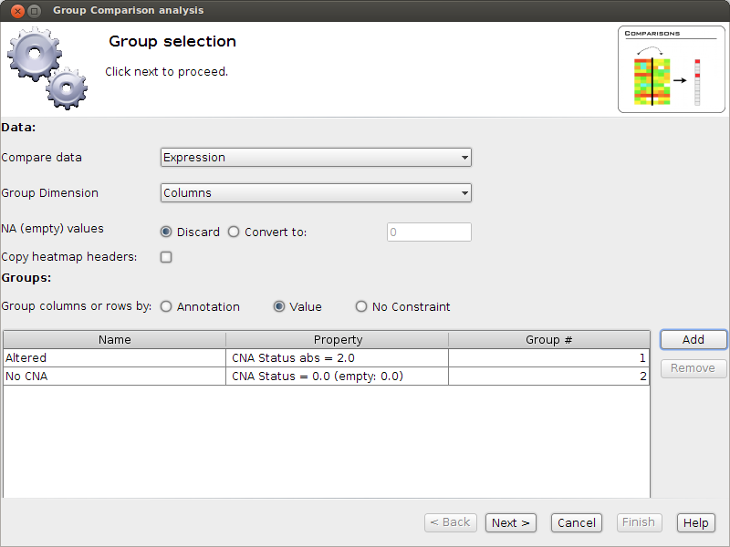

=====================================
Gitools from A to Z - The Tutorial
=====================================

.. contents::

Practical 1: Data Integration with Gitools
.......................................................

When we do many assays for the same patient it is helpful to have an integrated view of the different assays in order
to be able to infer dependencies. This may be complicated by the fact that often we get the data from different assays
in different formats. In this first excersice we have genomic alteration data from Glioblastoma tumour samples
(from the TCGA project) and would like to integrate the data to browse it as multi-dimensional heatmap in Gitools.
We will try to rebuild, with the data we have, the data matrix from the TCGA Glioblastoma heatmap that we can find
in Gitools prepared datasets. Last but not least, we will learn how to interact with Gitools interactive heatmaps:
Sort, Filter, Zoom.

Gitools can be downloaded from www.gitools.org. Unzip the file, enter the gitools/bin folder and run gitools if you are
a Mac or Linux user or gitools-2GB.bat if you are a Windows user.
Further details can be found at :doc:`UserGuide_Installation`.

:width: 500px
    :align: right

    #. In the :download:`material folder pdf<files/gitools-tutorial-data.zip>` you'll find a data_integration folder.
    The files in that folder contain data for the same samples cohort. But do they have the same format?
#. Check out each of the files and note what format they are in: What is the layout of the files, Matrix or Table?
    What separates the different data fields in the files? Comma, Tab, Semicolon, other character?
#. How many data layers does the TCGA GBM heatmap have? What data is represented?
#. Now we want examine the template heatmap first: Go to the Welcome tab in Gitools, select TCGA, then GBM and then
    click the preview image in order to load the matrix within Gitools.
#. What kind of values do we find for each data layer? Check out how the color-encoding with the color scale at the
    left bottom and the color-scale editing menu at ``Edit->Layers-> [...]``. Change the value layers by clicking on
    their names at the left, in the details box.
#. Now we would like to rebuild as good as possible the TCGA-GBM heatmap (disregarding column and row annotation). We want to
    - Integrate the heatmap files: Use File>Open and then ``Edit>Layers>New Layer...``
    - The same color scale (Use ``right click > Edit > Color scales or Edit > Layers > [...]``). Note that the type of scale and cut-off values are important, the color doesn't need to be identical to the teamplate.
    - The same order of data layers
    Explore the template heatmap as much as needed in order to recreate the color scales.
#. Save the result in ``.heatmap.zip`` format to the disk

Practical 2: Data annotation and Heatmap interactions
.......................................................

By now you have succesfully loaded, integrated data into a heatmap and saved it to the disk for further use.
But we need also to understand the data and the tool in order to interpret and interact with the data.
Below you find some concepts on how to interact and some steps to follow.

**Learning to interact with Gitools heatmaps**

    - Very helpful shortcuts at: *Help > Shortcuts*
    - **Selection**: Rows and Columns can be selected and deselected by clicking on the Ids. Selected items can be
        dragged and dropped. Selections influence sorting and other operations, thus in order to unselect all items you
        may click in the white area at the top right or with the keyboard: ``u+a`` (use ``r`` or ``c`` instead of "a" for Rows or
        Columns respectively). To select ranges use ``Shift``
    - **Zooming**: Zooming can be achieved by the scrolling gestures and holding down ``CTRL``. In order to zoom only
        columns hold down ``CTRL+c`` and for rows only ``CTRL+r``. The size of the information at the columns and rows can be
        resized with the same gesture - make sure the mouse is hovering the area you'd like to resize.
    - **Lead or Focus**: When you click into a cell, you will know which one you clicked on by the black
        lines marking the lead. At no moment, more than one cell can be in the focus. All the data that
        associated to the cell is displayed in the details panel at the left: All data layers and values and
        information associated with the row and column of the cell.

**Follow the next steps and save a bookmark with an appropriate after each.**

    #. *Visibility 1*: Make sure that you see the expression values and then that you see all the columns by right click on the columns and selecting Show all
    #. *Visibility 2*: Apparently not all samples have expression values. Select some samples with no values, right click and select Hide selected
    #. *Sorting 1*: Right click on one of the row names and select: Sort ascending by id
    #. *Sorting 2*: Make sure you have no rows and columns selected, right click on a column id and select Sort rows by values
    #. *Sorting 3*: Selecet the EGFR row, right click on EGFR and select Sort columns by selected values
    #. *Filtering 1*: We want to get rid of all samples with no expression associated. Select
        ``Edit > Columns > Filter by values``. As criteria select Expression abs > 0 and click OK.
    #. *Sorting 4*: Change to Copy Number values and select ``Edit > Rows > Sort by`` values and select as sorting
        criteria CNA Status, Count (Non-Zero), Descending and then sort the columns according to the CDKNA CNA status.
        Now switch between CNA and expression and save the last bookmark. Also, compare the values in CDKNA.

:width: 500px
    :align: right

**Data annotation**

Data interpretation depends mostly on additional information regarding the data taht we are vieweing. Therefore Gitools
allows to add annotations for columns and rows. Clinical annotation is crucial for interpretation of the sample data
whereas additional genomic information helps to understand who different genes are.

    #. In the material in the folder data_annotation you find the file ``gbm-subtypes.tsv`` which contains annotations
        for the columns of the matrix we have used in practical 1.
    #. Open it with a text editor to see the content and format of the file.
    #. In Gitools, right click in the columns and select Add column header. Select Values as color.
    #. Click ``Add annotation from file`` and load the file we've looked at. Select GBM-subtype as the annotation to add
        as a header and click Next
    #. Proceed to the cluster page. How many clusters are there? Do all samples have an annotation? Click finish
    #. Sort columns by annotation: Right click on the new color annotation and select "sort ascending by disease". Add a bookmark.
    #. Change the column width until there is enough space for all the cluster names to be displayed.

    *Gene annotation from Biomart*

    The ids that we have in the matrix are HGNC gene symbols. That is all the information we have for the genes.
    In these steps we will import annotations for each gene id to be able to distinguish better the different genes.

    #. Go to Download > Annotations > Biomart Table
    #. Select ENSEMBL GENES 74 (SANGER UK) in Databases and Homo sapiens genes at Datasets. Click Next.
    #. By using Add, Remove, Up and Down buttons select the following fields for your annotation file and click Next.
        .. image:: img/ScreenShotGitoolsImportGeneAnnotations.png
:width: 500px
            :align: center
        #. At the filters step, select to only download gene annotations for Chromosomes 1-22,X,Y and MT. You can specify the filter at REGION > Chromosomes
        #. Leave checked the option "Skip rows with empty values" in next window and click Next.
        #. Name the output file gene-annotations.tsv and save it to the data_annotation folder.
        #. Open the file that you have just imported with a text editor to see the content and format of the file.
        #. In Gitools, add the following headers:
            - Description as text. Right click in rows > add headers > Values as Text.
            - Chromosome Name as color. Right click in rows > add header > Values as color
        #. Sort the rows according to the chromosome. How many more genes are from the same chromosome as CDKN2A? Is there a kinase?

    Practical 3: Cause-Effect relationship between genomic alterations and expression
    ..........................................................................................

        "Cancer cells often exhibit a change in number of copies of certain genomic regions when compared to normal cells
        (Copy Number Alterations: CNAs). Some of these CNAs may have a direct influence on the expression of genes in
        the affected region. The change in the number of copies of a gene may be both positive, when additional copies
        are gained (and the genes thus amplified) or negative, when one or more alleles of the gene are lost. The influence
        of CNAs on the expression of these amplified or lost genes depends on whether it occurs hetero- or homozygously and
        also on other regulatory factors which may override the effect of the alteration. Therefore, an essential step to
        verify the importance of the amplification or deletion of a given gene in the tumorigenic process is to verify if
        its expression tends to respond to its genomic alterations." (Excerpt from our blog)

:width: 500px
    :align: right

    If we have gene alteration and expression data from all the samples we can explore the alterations within the
    sample set and switch the visualized data to expression to verify if we can see an effect of the genomic
    alteration in the expression. We want to know which genes' expression seems to be most influenced by
    alteration events in the TP53 pathway. In other words, we want to know the cis-effect of the alterations in the pathway.
    We can **explore the cis-effect** this by eye as shown in the image of this section on the right, and we can make a
**group comparison analysis** which gives us the means to compare two sample groups of expression data for each
gene and decide if there is a significant difference between them.

:width: 500px
    :align: right

        #. If not open already, download and open the TCGA-GBM heatmap from Gitools datasets. Select to show all rows (genes). How many genes does the data set contain?
        #. Switch to showing expression data and filter out the samples with no expression data.
        #. Switch to CNA status: want to know how many CNA events we observe per gene. Right click on a gene name and select "Add header"
        #. Select "Aggregated heatmap values as" will count the events per gene. In the wizard we will select the following:
            - **Data source**: CNA status, aggregated by Count (non-zero)
        - **Header configuration**: Rename set the Title to "Count"
        - **Color Scale**: Set color scale max to 80
        - **Finish**
    #. After adding the aggregated values as row header, right click on it and select Sort all rows des. by Count. If first, they are sorted ascending, repeate the same step as now the will be sorted descending.
    #. Find a gene that has 10 CNA events, right click on the count and select:
    #. It's important to know what values represent Gain and Loss. If necessary look at the CNA color scale and write down the values. Which value is used for Loss? Which value is used for Gain?
    #. Now select Analysis Group Comparison. A window will pop up - it will guide us through the analysis.
        - Select to take values from **expression**.
        - Unselect ``Copy heatmap headers``.
        - Select to ``group by Value``: We want to group columns according to their CNA value.
        - Add two Value groups as shown in the Image. The first called Altered. Pay attention to the comparator ``"abs =".``
            Why do we have to choose this one?
        - The second group is called "No CNA". Pay close attention to (empty: 0). This means that empty values should
            be considered as 0. Why do we have to choose this option?
    #. Now we have set that we want to compare Expression values of Altered vs No CNA samples, for each gene.
        Click next and read the test description (make a screenshot as it may help to interpret the results).
    #. Now go to "Finish"; you will see a new analysis has been opened. Click on the "Heatmap" button under results
        to see the group comparison analysis results.
    #. You will have one column with the result of the test for each gene. Make the column wider until you can
        see the group names at the top
    #. What do the colors mean? Compare the p-value-log-sum with right-tail and left-tail significance.
    #. The columns are ordered in the same order as in the data heatmap. Is there a strong correlation between
        significance of the result to the number of events?
    #. Sort the rows by p-value-log-sum (Absolute sum, Descending)
    #. Look at the top four differential expressed genes. What are their values? Do they have a significant
        left-p-value? A significant right-p-value? Which are likely to be affected by Gain or Loss? How many altered
        and unaltered samples have been observed for each of the genes?

Practical 4: Sample Level Enrichment Analysis (SLEA)
..........................................................................................

The Sample Level Enrichment Analysis (SLEA) allows us to collapse the expression level status from a group of
genes (as for example pathways) into a single row in the heatmap.

We will perform the SLEA with the Glioblastoma median-centered expression data. Additionally to that we need a
module file - the file that describes which gene groups (or modules) we want to analyze. We already prepared
a file containing some KEGG pathways modules in a Two-columns mapping (TCM) format (``kegg.pathways.tcm``).

Windows user may want to choose start Gitools with the .bat-file with 2GB RAM or more to speed up the calculations.

First let us prepare the data:

    #. As data source we use the TCGA BRCA heatmap from Gitools heatmaps. (In the welcome tab Select: TCGA>Breast)
    #. With the open heatmap we select to view the Expression data. As we can see, not all samples have expression data. We filter out those samples by selecting Edit > Columns > Filter by values. As filter criteria we select: Expression > 0.05, thus all columns with no values at all are autmoatically excluded.
    #. Now, we select to show all rows by right clicking on a row and selecting Show all
    #. As a last preparations step we want to export some sample annotations we will use in the result: Select the menu File > Export > Annotation, then visible columns, and finally select the id and iCluster to export to a text file with these two columns.

To perform SLEA in Gitools we will perform an enrichment analysis with continuous values since we want to measure the grade of enrichment rather than a boolean enriched or not. A step-by-step wizard will show up and will guide us through the analysis setup. For our SLEA we will need to do the following steps:

:width: 500px
    :align: right

        #. In the first page we can leave by default, no filtering options need to be applied
        #. Select modules: Here we need to indicate which file contains the modules data with the five KEGG pathways (kegg.pathways.gmt). Leave the other options as by default.
        #. Select the statistical test: On this page we need to select Z Score. Under normal circumstances you should not lower the sampling size - but for today's course we will set it to 1000, so that the analysis is calculated quickly; bear in mind, though, that the statistical significance of the results will not be as trustable. We recommend 10000 permutations for a final result, and 1000 for preliminary tests.

        #. Select a directory to save the analysis results and hit finish.

    Once you have the results, open them by going to "Heatmap" under "Results" in the new screen that appeared in Gitools. Remember that you can save the analysis and afterwards always open it again.

        #. First, to put our data in context use the before exported file (iCluster-annotation) as column annotations and kegg.pathways.tcm.annotions.tsv to add the annotation as colored labels and text respecitvely.
        #. To get to know the data: what are the values of N and Z-Score for the first sample TCGA-A8-A08H in Cell adhesion molecules (hsa04514)? Are then Oxidative stress genes in that sample up or down-regulated? Is there a p-value which confirms if the mis-regulation is significant?
        #. Change the width of the cells so that you can see all the samples on the screen. If it helps to see the data better, deactivate the columns grid of the heatmap.
        #. Are there pathways that are clearly up- or down-regulated? If not, proceed with the following steps.
        #. We will try to get a clearer picture of the data by looking at it in the context of clinical annotations. Since you have added before a color annoatation for GBM-subtype, click on the annotation and select: Sort ascending by icluster
        #. Can you see pathways that show a specific pattern of mis-regulation for clusters now?
        #. Save the results heatmap for later use

    Practical 5: Sample comparison: Clustering and Correlation
    ..........................................................................................

**Correlation**
The SLEA result from step 4 already reveals that different samples have different expression levels for some pathways. The clusters from the iCluster analysis already reveals that there are groups of samples that seem similar one to another. If we are not happy with the grouping, we have other options of comparing the samples: we can cluster similar samples together or we can perform a correlation analysis which gives a result of similarity measures of samples.
Correlations

    #. To performa a correlation analisys select Analysis > Correlation
    #. Choose the z-score values to correlate and perform the analysis.
    #. Open the result heatmap. It is a triangular heatmap that gives the correlation for each sample combination.
    #. Annotate the columns and rows with iCluster. Thus you can see which samples from which clusters correlate or anti-correlate.

:width: 500px
    :align: right

**Clustering**

You can choose to do a clustering with either the SLEA-result or the correlation of the samples. As a start we can do a hierarchical clustering with the SLEA-result samples.

    #. Select Analysis > Clustering.
    #. Select as Method Hierarchical and as value z-score.
    #. For continuous values, the distance and link type are already well chosen by default. Click finish.
    #. A new tab will open with the exact tree of hierarchies. You may leave it open for later consulting. It cannot be displayed directly on the heatmap since any change to the sample order invalidates it.
    #. Change to the heatmap and see that colors representing the tree clustering have been added to the samples. Ten different levels are being displayed.. at the top the more specific leaves of the clustering tree. The samples with more white (empty) clusters are the ones considered more outliers.
    #. Note that a bookmark has been added with the clustering order stored.
    #. Similar samples should be clustered together.

:width: 500px
    :align: right

    With the correlation result we could to the same, but it is computationally very expensive. Therefore we choose to do a K-means clustering.

        #. When doing a K-means clustering, we need to choose how many clusters we want to have. Check the hierarchical clustering at level 5 or 6 and decide a good number of clusters.
        #. Select Analysis > Clustering
        #. Select the K-means clustering for z-scores and columns.
        #. In the settings of the clustering change the num. clusters to the number you decided and click finish.
        #. Similar samples should be clustered together, which you can see along the diagonal where similarity triangles accumulate

