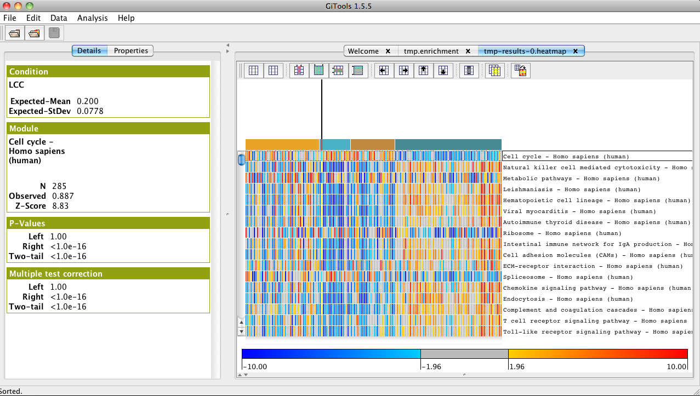

========================================================================
Tutorial 2.1. Sample Level Enrichment Analysis (SLEA) with KEGG pathways
========================================================================

Identify pathways which genes are differentially expressed in various groups of samples

We will use a data set containing 156 non-small cell lung carcinomas and adjacent normal lung tissue sample from  `Hou et al 2010 <http://www.plosone.org/article/info:doi/10.1371/journal.pone.0010312>`__ .

Files needed
------------

- `gse19188\_median-centered.cdm.gz <http://www.gitools.org/tutorials/data/gse19188_median-centered.cdm.gz>`__  which contains median-centered log-intensity values divided by standard deviation for 156 samples.

- `gse19188\_sample\_annotations.txt  <http://www.gitools.org/tutorials/data/gse19188_sample_annotations.txt>`__  which contains the clinical annotation of samples

Import human KEGG pathway modules using Gitools
-----------------------------------------------

- Import human KEGG pathways. See  `this chapter <UserGuide_KEGG.rst>`__  of the user guide for further guidance.

- Select “Affy HG U133-PLUS-2” as identifiers for the genes, which correspond to the probe identifiers we have in our dataset. 

- Alternatively download the KEGG pathways module map and annotations from here:
   - `homo\_sapiens\_\_kegg\_pathways\_\_ensembl\_affy\_hg\_u133\_plus\_2.tcm <http://www.gitools.org/tutorials/data/homo_sapiens__kegg_pathways__ensembl_affy_hg_u133_plus_2.tcm.gz>`_
   -  `homo\_sapiens\_\_kegg\_pathways\_\_ensembl\_affy\_hg\_u133\_plus\_2\_annotations.tsv <http://www.gitools.org/tutorials/data/homo_sapiens__kegg_pathways__ensembl_affy_hg_u133_plus_2_annotations.tsv.gz>`_

Perform an enrichment analysis with Gitools
-------------------------------------------

- See  `this chapter <UserGuide_Enrichment.rst>`__  for details on how to perform enrichment analysis

- Select gse19188\_median-centered.cdm.gz as data file

- Do not select any filtering option

- Select the pathway file as module file (homo\_sapiens\_kegg\_pathways\_ensembl\_affy\_hg\_u133\_plus\_2.tcm).

- Select zscore statistical test. Write 100 in sampling size for a quick test of the analysis. To get a definitive result run the analysis with 10000, however take into account that in this case the anlysis will take long time to finish. Leave estimator and multiple test correction as default.

- Give a name to the analysis. Select a directory where to safe it and click Finish.

- If you have a memory problem, see memory configuration in (  `Installation Guide <UserGuide_Installation.rst>`__ ) to increase the memory allocated to run Gitools.

Use annotations for pathways and annotation colors for samples
--------------------------------------------------------------

- In the analysis details tab, click on ``heatmap`` under ``Results`` to view the heatmap of the results.

- Change the color scale to z-score scale in the properties/cells tab under “scale”.

- In properties/rows, select the file ``homo_sapiens_kegg_pathways_ensembl_affy_hg_u133_plus_2_annotations.tsv`` and choose “name” as label to show the name of the pathways instead of the id in the heatmap. 

- In properties/columns, select the file “gse19188\_sample\_annotations.txt” and choose “histology” as label to show the type of tumour instead of the id of the sample as column name in the heatmap.

- Select annotate with color to show a color label for the type of histology of the samples.

- Sort the samples by histology by selecting ``Data>Sort>Sort`` by label and select columns.

- Change the width of the cells in properties/cells to be able to see all the samples in the window and uncheck the option to show the columns grid.

Explore the results
-------------------

