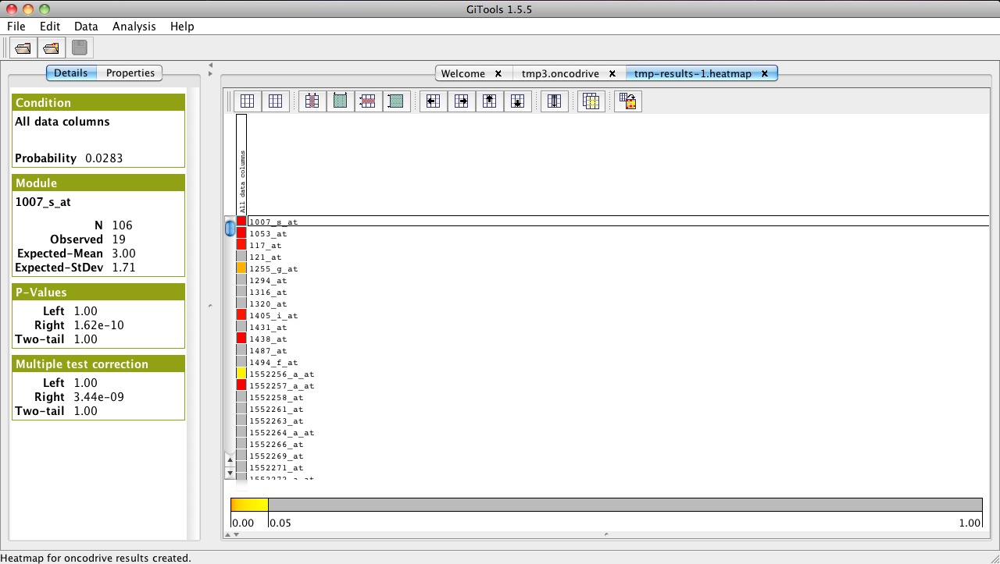

=========================================================
Tutorial 2.3. Identifying significantly upregulated genes
=========================================================

Run Oncodrive to identify the genes that are significantly up-regulated taking into account a set of tumour samples

Files needed
------------

`gse19188\_l2r-cancer-vs-normal.cdm.gz <http://www.gitools.org/tutorials/data/gse19188_l2r-cancer-vs-normal.cdm.gz>`__ : which contains log2 ratios of tumour samples versus normal controls.

Run Oncodrive analysis
----------------------

See  :doc:`UserGuide_Oncodrive`  for details on how to run an Oncodrive analysis

- Select :file:`gse19188_l2r-cancer-vs-normal.cdm.gz` as data file

- In filtering options choose “Transform to 1 (0 otherwise) cells with values greater than 1.297 (this is the optimal cutoff for this dataset obtained as explained in the supplementary material of  `IntOGen paper <http://www.nature.com/nmeth/journal/v7/n2/full/nmeth0210-92.html>`__ ).

- Do not select anything in the sets of columns window.

- Leave the default values in the statistical test window (binomial, and Benjamin Hochberg FDR).

- Give a name to the analysis. Select a directory where to save it and click Finish.

- In the analysis details tab, click on “heatmap” under “Results” to view the heatmap of the results.

Import annotations for probes using Gitools
-------------------------------------------

- Import Ensembl gene ids, symbol and description for probes in the Affymetrix HG U133 Plus 2 platform.

- Go to the Welcome tab and click the Biomart wizard. Choose “Table” and click Next.

- Select “Ensembl Genes 62” and “Homo Sapiens”, and then the desired attributes. Leave only “Ensembl Gene ID” from the defaults, and add “Description” (under Gene/ENSEMBL), “Associated gene name” (under Gene/ENSEMBL) and “Affy HG U133-PLUS-2” (under microarray).

- Bring up in the list the Affymetrix attribute and click Next.

- Do not apply any filters, and skip rows with empty values.

- Give a meaningful name to the file, select an output folder where to save it and finish.

- Load the annotations for rows by going to the rows tab under properties and loading the annotation file. Click “Filter”.

- Add a header in the rows tab and select “Text labels”, then “Ensembl Gene ID” and finish. Do the same for the other two annotations.

- Bring up the header for “Associated Gene name” and sort by this label.

- Alternatively, you can download the Affymetrix HG U133 Plus 2 ids from here:
   - `homo\_sapiens\_affy\_u133\_plus\_2\_annotations.tsv <http://www.gitools.org/tutorials/data/homosapiensaffyu133plus2annotations.tsv>`__

Explore the results
-------------------

