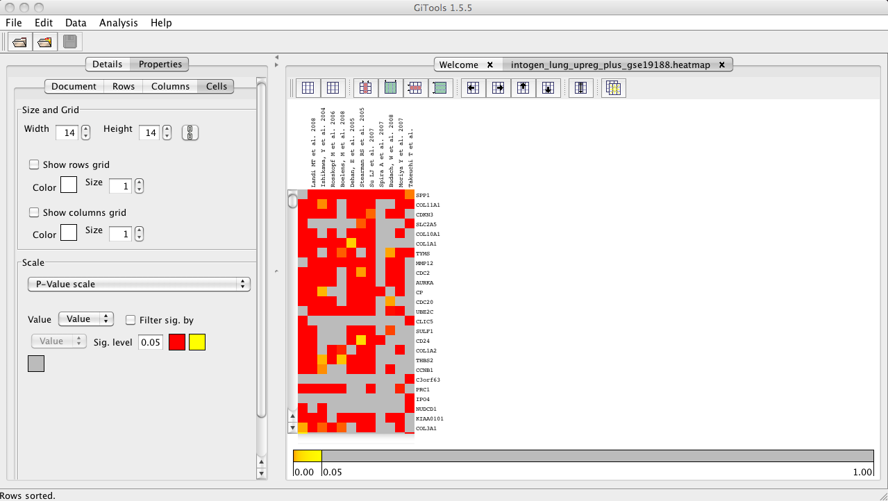

=============================================
Tutorial 2.4: Compare and combine experiments
=============================================

Compare and combine the significantly up-regulated genes in our experiment and in other lung experiments imported from IntOGen

Files needed
------------

- `intogen\_lung\_upreg\_plus\_gse19188.cdm.gz <http://www.gitools.org/tutorials/data/intogen_lung_upreg_plus_gse19188.cdm.gz>`__ : matrix file containing p-values for upregulation per gene for 11 experiments imported from IntOGen and the experiment from Hou et al. that we analyzed in the previous tutorial.

- `intogen\_lung\_upreg-columns.tsv.gz <http://www.gitools.org/tutorials/data/intogen_lung_upreg-columns.tsv.gz>`__ : file with annotations of columns (experiments) for the matrix above

- `intogen\_lung\_upreg-rows.tsv.gz <http://www.gitools.org/tutorials/data/intogen_lung_upreg-rows.tsv.gz>`__ : file with annotations of rows (genes) for the matrix above

Import p-value matrix from IntOGen for up-regulation in various independent lung cancer experiments.
----------------------------------------------------------------------------------------------------

- For this tutorial, we provide the matrix file containing p-values for these lung experiments plus the result of the oncodrive analysis in tutorial 2.3, after mapping probes to genes, see files above.

- See  `this chapter <UserGuide_IntOGen.rst>`__  of the user guide to learn how to import data from IntOGen.

Open heatmap and change scale and labels
----------------------------------------

- ``File>Open>Heatmap…`` and select the file :file:`intogen\_lung\_upreg\_plus\_gse19188.cdm.gz`.

- Change the color scale to p-value scale (in Settings).

- Change the labels of columns: In Settings, select the file file:`intogen_lung_upreg-columns.tsv.gz` and choose “authors” and “year” as label to show in the columns instead of the id of the experiment.

- Change the labels of rows: In properties/rows, select the file file:`intogen\_lung\_upreg-rows.tsv.gz` and choose “symbol” as label to show in the rows instead of the ensembl id of the gene.

- Select all the rows and sort to have the most significantly up-regulated genes in the various lung cancer experiments on top.

Combine
-------

- To combine the p-values of all the lung cancer experiments, select Analysis>Combinations. 

- See  `this chapter <UserGuide_Combinations.rst>`_  for further details on how to combine experiments.

- Apply to columns, with all columns with the same weight.

- Do not select any file for sets of columns or rows to combine, this way we will combine all columns of the heatmap.

- Click Next and Finish.

Explore the results
-------------------

.. image:: img/tutorial-gitoolscasestudy2.4.2.png
