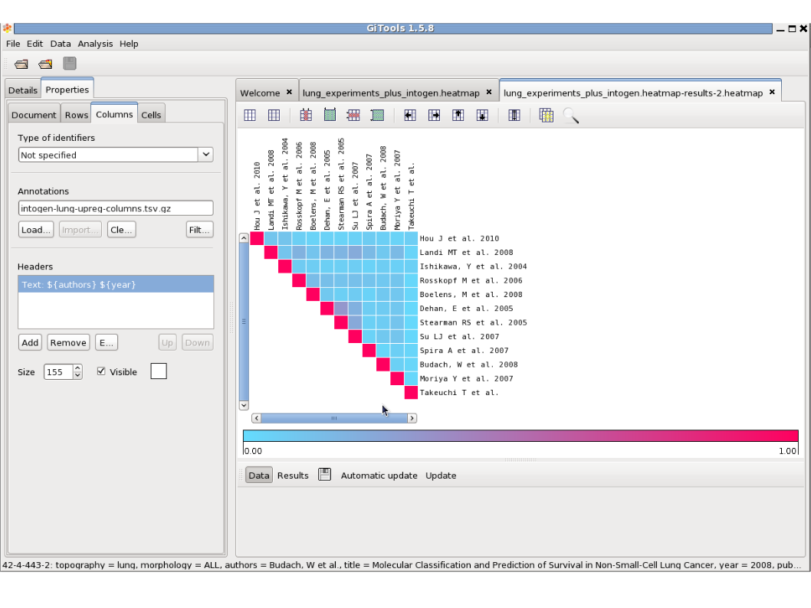

==================================
Tutorial 2.5: Overlapping analysis
==================================

Compare the overlapping of significantly up-regulated genes in our experiment and in other lung experiments imported from IntOGen.

Files needed
------------

The files needed for this tutorial are the same as the ones for tutorial 2.4.

- `intogen\_lung\_upreg\_plus\_gse19188.cdm.gz <http://www.gitools.org/tutorials/data/intogen_lung_upreg_plus_gse19188.cdm.gz>`__ : matrix file containing p-values for upregulation per gene for 11 experiments imported from IntOGen and the experiment from Hou et al. that we analyzed in the previous tutorial.

- `intogen\_lung\_upreg-columns.tsv.gz <http://www.gitools.org/tutorials/data/intogen_lung_upreg-columns.tsv.gz>`__ : file with annotations of columns (experiments) for the matrix above

- `intogen\_lung\_upreg-rows.tsv.gz <http://www.gitools.org/tutorials/data/intogen_lung_upreg-rows.tsv.gz>`__ : file with annotations of rows (genes) for the matrix above

Run overlapping analysis
------------------------

See `this chapter <UserGuide_Overlaps.rst>`__  for details on how to perform overlapping analysis

- We will do an analysis to see how many genes that are significantly up-regulated in each of the experiments are also significantly up-regulated in the other experiments.

- Select file:`intogen-lung-upreg-plus-gse19188.cdm.gz` as data file

- In Data Filtering Options choose “Transform to 1 (0 otherwise) cells with values less than 0.05”

- In Configure Overlapping Options, select: Replace empty values by 0. Apply to columns. Click Next.

- Select a destination folder and file name and click Finish.

Change labels of rows and columns
---------------------------------

- In properties/columns, select the file file:`intogen-lung-upreg-columns.tsv.gz` and choose “authors” and “year” as label to show in the columns instead of the id of the experiment.

- Do the same for rows.

Change the value to be displayed in the heatmap
-----------------------------------------------

- Select the value “Row only proportions” to show in colors the proportion of genes in the experiment of the column that are up-regulated in the experiment of the row.

Explore the results
-------------------------------------------------

