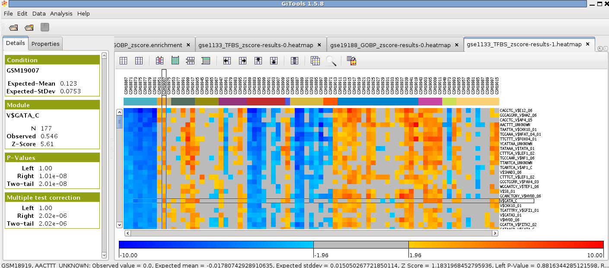

======================================
Tutorial 4.1. TFBS enrichment analysis
======================================

Identify regulatory modules which are differentially expressed in various human tissues
---------------------------------------------------------------------------------------

We will use the GeneAtlas dataset, which is a collection of expression data for 72 samples from different human normal tissues, plus 7 malignant tissues, from  `Su et al 2004 <http://www.ncbi.nlm.nih.gov/pmc/articles/PMC395923/?tool=pubmed>`__  and we will test if genes expressed in different tissues are enriched by genes with particular Transcription Factor Biding Sites (TFBS) in their promoters.

Files needed
------------

`Gene Atlas expression in Entrez IDS <http://www.gitools.org/tutorials/data/gse1133-entrez-log2-abs-reading.mediancentered.cdm.gz>`__  which contains median-centered log-intensity values divided by standard deviation for 79 tissues.

`Gene Atlas sample annotations <http://www.gitools.org/tutorials/data/gse1133-annotation-full.tsv>`__  which contains the annotation of samples.

`MSigDB TFBS <http://www.gitools.org/tutorials/data/c3.tft.v3.0.entrez.gmt>`__, which are the Transcription Factor Targets modules downloaded from  `MSigDB C3 <http://www.broadinstitute.org/gsea/msigdb/collections.jsp#C3>`__  in Entrez IDs. They are gene sets that contain genes that share a transcription factor binding site defined in the TRANSFAC (version 7.4,  `http://www.gene-regulation.com/ <http://www.gene-regulation.com/>`__ ) database. They can be directly downloaded from their web page  `here <http://www.broadinstitute.org/gsea/msigdb/download_file.jsp?filePath=/resources/msigdb/3.0/c3.tft.v3.0.entrez.gmt>`__  too, but it requires a free registration.

Perform an enrichment analysis with Gitools
-------------------------------------------

See `UserGuide_Enrichment` for details on how to perform enrichment analysis

Select :file:`gse1133-entrez-log2-abs-reading.mediancentered.cdm.gz` as data file

Do not select any filtering option

Select the TFBS file from MSigDB as module file (c3.tft.v3.0.entrez.gmt).

Select zscore statistical test. Write 100 in sampling size for a quick test of the analysis. To get a definitive result run the analysis with 10000; however, take into account that in this case the analysis will take a long time to finish. Leave estimator and multiple test correction as default.

Give a name to the analysis. Select a directory where to save it and click Finish.

If you have a memory problem, see “Memory configuration” in the :doc:`UserGuide_Installation` to increase the memory allocated to run Gitools.

Use annotation colours for samples
----------------------------------

In the analysis details tab, click on “heatmap” under “Results” to view the heatmap of the results.

Change the colour scale to z-score scale in the settings tab under “scale”.

Filter significance by Corrected two-tail p-value by checking the box below.

Load the file “gse1133-annotation-full.tsv” as Annotations and click Filter.

Go to “Add” under “Headers”, choose “Colored labels from annotations”. Choose “class” as label to show the type of tissue instead of the id of the sample as column name in the heatmap and uncheck the “Grid between different clusters”.

Sort the samples by class by selecting Data>Sort>Sort by label and select columns>class.

Change the width of the cells in settings to be able to see all the samples in the window and uncheck the option to show the columns grid.

Explore the results
-------------------

