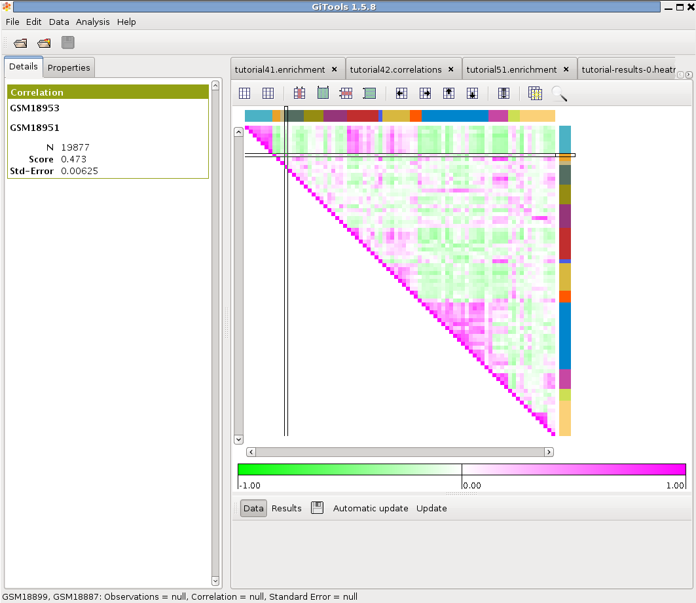

=====================================================================
Tutorial 4.2. Correlation of expression patterns in different tissues
=====================================================================

Compare the expression profile of samples using correlations
------------------------------------------------------------

Files needed:
-------------

We will need the same files as in the tutorial 4.1:

`Gene Atlas expression in Entrez IDS <http://www.gitools.org/tutorials/data/gse1133-entrez-log2-abs-reading.mediancentered.cdm.gz>`__  which contains median-centered log-intensity values divided by standard deviation for 79 samples.

`Gene Atlas sample annotations <http://www.gitools.org/tutorials/data/gse1133-annotation-full.tsv>`__  which contains the annotation of samples.

Perform correlation analysis
----------------------------

See  :doc:`UserGuide_Correlations`  for details on how to perform correlation analysis

Select :file:`gse1133-entrez-log2-abs-reading.mediancentered.cdm.gz` as data file

Do not select any filtering option

Apply correlation to columns (as we want to correlate samples)

Give a name to the analysis. Select a directory where to safe it and click Finish.

Colour the columns and rows according to the class label of the tissue samples and order them
---------------------------------------------------------------------------------------------

In the analysis details tab, click on “heatmap” under “Results” to view the heatmap of the results.

In properties/columns, load the file :file:`gse1133-annotation-full.tsv` under Annotations and click Filter.

Go to “Add” under “Headers”, choose “Colored labels from annotations”. Choose “class” as label to show the type of tissue instead of the id of the sample as column name in the heatmap.

Do the same for rows.

Uncheck the “Grid between different clusters”.

Sort the samples by class by selecting Data>Sort>Sort by label and select columns>class.

Change the width of the cells in properties/cells to be able to see all the samples in the window and uncheck the option to show the columns grid.

Explore the results
-------------------

