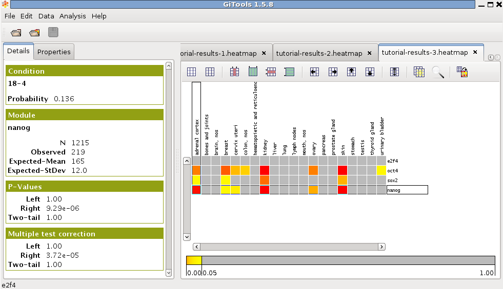

================================================================
Tutorial 5.1. Regulatory Modules enrichment analysis
================================================================

Study the misregulation in different cancer types of modules derived from binding experiments such as ChIP-sequencing
---------------------------------------------------------------------------------------------------------------------------------------------------

**Files needed:  **

Significantly down-regulated genes in each tumour morphology type from IntOGen, which contains p-values for cancer driver
genes. To obtain it follow  Tutorial 1.1 ( :download:`download pdf<files/tutorial11importintogentumortypes.pdf>` ),
but change the type of alteration to “downreg”.

Set of genes (module) experimentally found to be bound by specific transcription factors.
We will use the set from  `Boyer et al 2005 <http://www.sciencedirect.com/science/article/pii/S0092867405008251>`__ 
(Supplementary Table 3), which has been already mapped into Ensembl gene IDs for this tutorial 
`download: <http://www.gitools.org/tutorials/data/boyer.tcm>`_.

Perform enrichment analysis
-------------------------------------------------

See Tutorial 1.3 ( :download:`download pdf<files/tutorial13runenrichmentIntOGenKEGG.pdf>` )
for details on how to perform enrichment analysis.

Select the IntOGen down-regulated cancer genes as data file, and transform the continuous data matrix to a binary one by choosing a transformation criterion of “less that 0.05”, since the matrix contains p-values.

Select the experimental binding sites file as module file (file:`boyer.tcm`).

Select binomial statistical test. Leave estimator and multiple test correction as default.

Give a name to the analysis. Select a directory where to save it and click Finish.

If you have a memory problem, see memory configuration in ( :doc:`UserGuide_Installation` ) to increase the
memory allocated to run Gitools.

Use annotations for cancer types
-------------------------------------------------

In the analysis details tab, click on “heatmap” under “Results” to view the heatmap of the results.

In settigs, select the file for IntOGen column annotations and choose “topography” as label to show the name of the cancer type instead of the id of the sample in the heatmap.

Sort the samples by cancer type by selecting Data>Sort>Sort by label and select columns > “topography”.

Change the width of the cells in properties/cells to be able to see all the samples in the window and adapt the header size in the columns.

Explore the results
-------------------------------------------------

