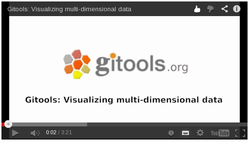

================================================================
Tutorial 6.1. Loading and annotating a multi-value matrix
================================================================

Loading and annotating a multi-value matrix
-------------------------------------------------

In this video tutorial you can learn the following things:

How to load the multi-dimensional data into Gitools and customize the visualization of the heatmap.

How to navigate across the data and different dimensions.

How to load and create annotation for your for the heatmap.

:target: https://www.youtube.com/watch?v=a85IY9CijNU

**TDM-format**:  :ref:`tdm`

The video on YouTube:  `http://www.youtube.com/embed/a85IY9CijNU <http://www.youtube.com/embed/a85IY9CijNU>`__

Files needed:
-------------------------------------------------

Download this  ` zip-file <http://www.gitools.org/tutorials/data/gitools_case_study_6.zip>`__ , which includes:

- Glioblastoma cancer data matrix. 
- TP53 signalling-pathway gene list
- Gene annotation file
