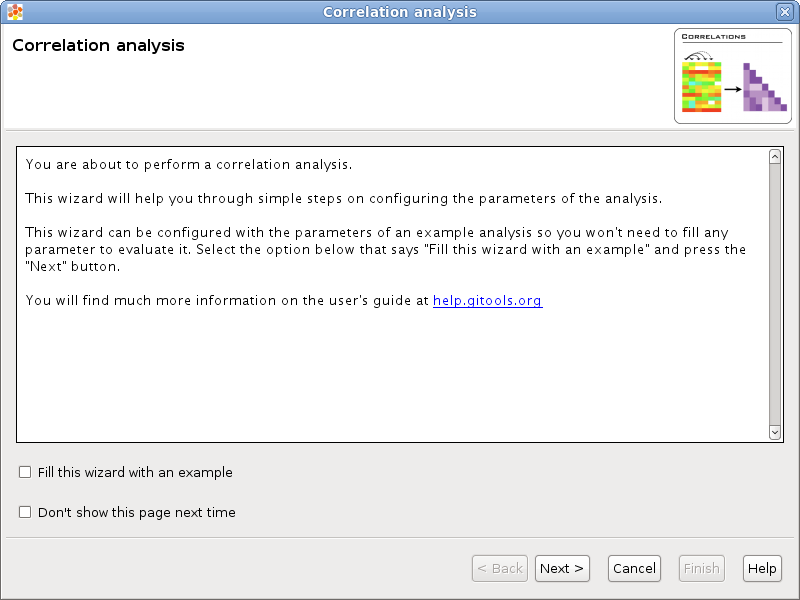
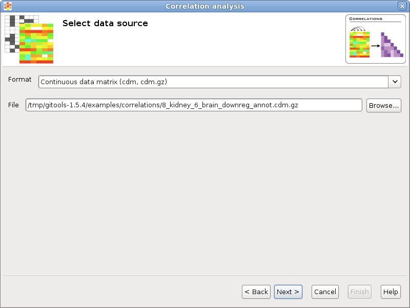
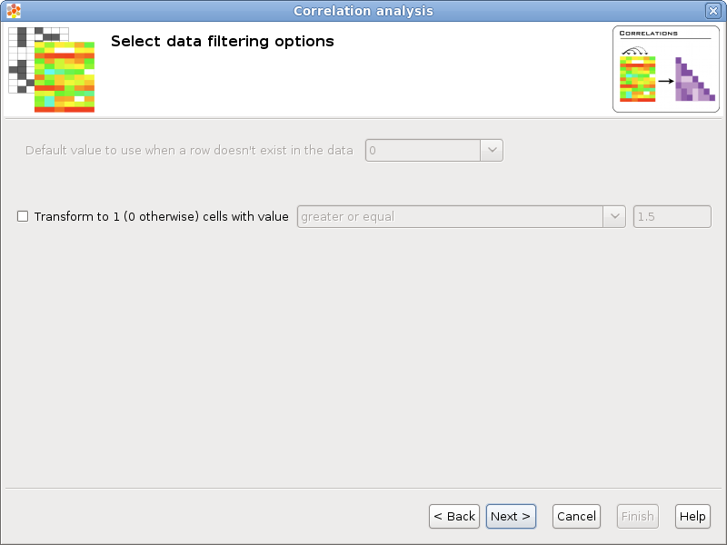
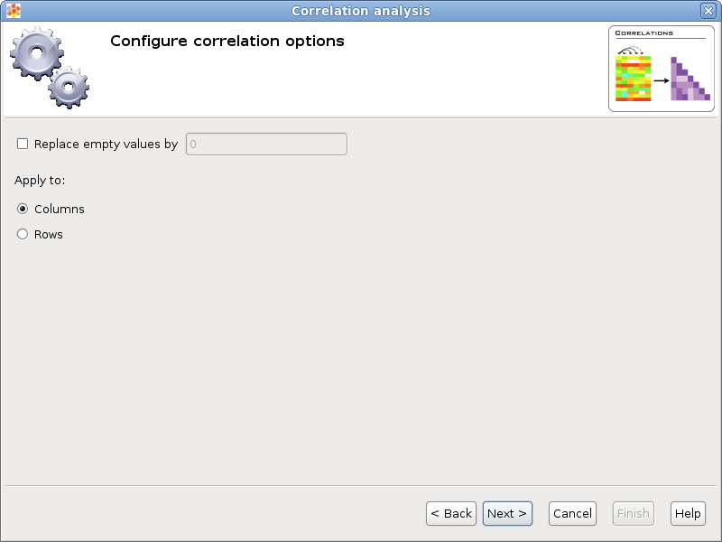
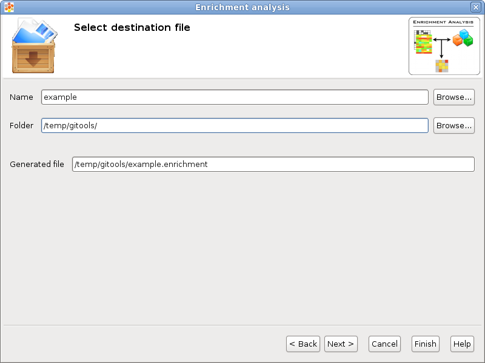
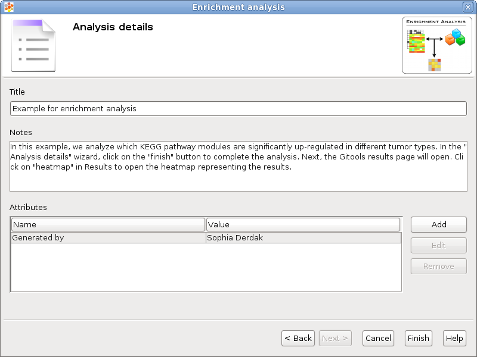
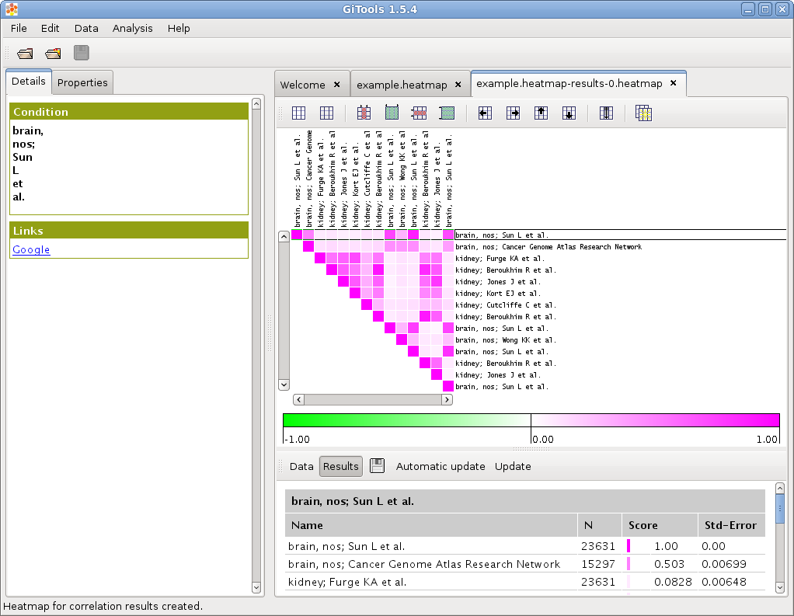

================================================================
Correlations
================================================================

The correlation analysis can be used to compare patterns among matrix columns or rows, for example to compare patterns of expression among genes for different samples.

Wizard steps to perform a correlation analysis
-------------------------------------------------

Before running a correlation analysis you should have this data prepared in files:

A matrix with the data resulting of your experiment (i.e. an expression matrix) or a list or lists of elements (i.e. genes or probesets) that has been found significant after other analysis (i.e. after differential expression you get lists of genes over and under expressed).

To start the wizard go to the menu *File > New > Analysis > Correlation analysis ...*

You can also start a correlation analysis from an opened heatmap by selecting the menu *Analysis > Correlation.*

Presentation and example
-------------------------------------------------

If you select the option **Fill this wizard with an example** all the following wizard pages will be filled with example files and parameters. In some situations the example files will be downloaded automatically before you can go to the next page. By default, when Gitools is installed from the zip file, the examples are already included. But when Gitools is executed directly from the web page the example files have to be downloaded the first time they are used. In that case the files are cached at *$HOME/.gitools/examples*.

You can avoid this first presentation page by selecting the option **Don’t show this page next time**.

Selection of the data to analyze
-------------------------------------------------

If you follow the conventions on file formats explained  :doc:`here </UserGuide_ImportingData>`  then simply click on the button [Browse] and select the file containing the data to analyze. The format selector will recognize the extension of the file. If your data file doesn’t have a known file extension then you should specify which is the format of the file.

Selection of the data transformation options
-------------------------------------------------

**Transform to 1 / 0:** Some statistical tests are designed to work with discrete events (as Binomial or Fisher’s exact tests), this option allows to transform a matrix with real values into a binary matrix containing only 1’s and 0’s for the analysis. All the values which satisfy the condition will be transformed to 1 and the rest to 0. For example, if the data file is an expression matrix with log :sub:`2` ratios it can be transformed to a binary matrix having a 1 for all the log :sub:`2` ratios greater than 1.5. Other possible application is when the matrix have p-values, if a significance of 0.05 is considered, all values less than 0.05 could be transformed to 1’s.

Configure correlation options
-------------------------------------------------

When correlating two columns/rows could happen that one or both of them don’t have a value defined and then this row/column can not be considered for the correlation. If you select the option **Replace empty values by** and put a value then empty cells will be replaced by the given value when doing calculations.

The option **Apply to** allows to select whether to correlate columns or rows.

Selection of the destination file
-------------------------------------------------

This wizard page allows to specify the prefix name for the files generated during the analysis and the folder where they will be created. The text in name and folder can be freely edited but it is also possible to navigate through the system folders in order to select an existing file by pressing the button [Browse].

Analysis details
-------------------------------------------------

This step is optional but recommended as it allows to give some details about the analysis for better organization and annotation of the results for future reviews.

It is possible to specify free attributes for the analysis as Organization, Operator, Platform and so on.

Exploring the results of the analysis
-------------------------------------------------

After performing the analysis a new editor with the details of the analysis will be opened:

To explore the data matrix resulting from the transformations with a heatmap click on the **Heatmap** button in the **Data** section.

To explore the results of the analysis with a heatmap click on the **Heatmap** button in the **Results** section.

