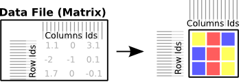
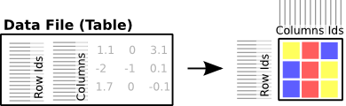

======================================================
Data types: Matrices, Modules and Annotations
======================================================
.. _datatypes:

.. contents:: 

There are different kinds of data files that can be loaded into Gitools for different aspects of the heatmap or analysis:
 * **Data Matrices** : The heatmap data
 * **Annotations** : Metadata for columns and rows of the heatmap
 * **Modules** : Groupings of columns or rows, used e.g. for pathway enrichments etc.

Data Matrix File
..................

**Any common (flat) text files that can be imported as data matrix to Gitools.** It has to be either in matrix-layout or table-layout

A matrix is a bidimensional structure in which for each row and column there is a value (one value-dimension) or multipe values (multiple value-dimensions). All the values are of one dimension are the same type (for example all are p-values or log ratios).

Matrices provide values for a number of items (i.e. one gene for each row) in several conditions/samples (i.e. one sample for each column). There could be empty values too (usually represented as a hyphen ’-’ or an empty field in text file formats).

Matrix layout file
,,,,,,,,,,,,,,,,,,,,,,,,,,,
Flat files containing data in matrices can only contain data for a single value dimension:  **each line contains data for one heatmap row**

:width: 700px
   :align: center
       :alt: Matrix Layout

    Table layout file
    ,,,,,,,,,,,,,,,,,,,,,,,,
    A flat file in table layout may contain multiple data layers/dimensions (multiple values per cell): **each line in the file contains data for one cell in the heatmap**. See for exampe the ``.tdm`` format

:width: 700px
   :align: center
       :alt: Table Layout

Module File
.............

Modules are lists of genes or other biological elements with a common biological property. They are also known as gene sets or concepts. For example, genes in the same pathway or genes regulated by the same transcription factor can form toghether one module. You can have many modules, i.e one for each known pathway or TF.

Annotations File
....................
A table represents a list of attributes, where each row is an element of the list and each column an attribute where the first column has to be the id of the heatmap column or row. Each attribute can be of different type (i.e. one column with the gene id and other with a log-ratio). For R users it is the equivalent to data.frame.

In Gitools they are used for different things, for providing extra attributes to row and column labels in heatmaps and for representing results of some analysis.

