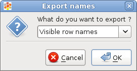
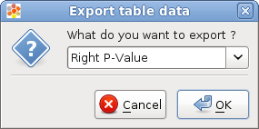
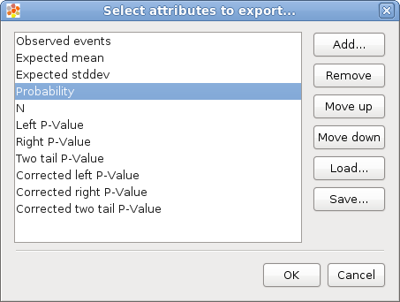

================================================================
Export heatmap data
================================================================

Labels (annotation)
-----------------------

When editing a heatmap the visible or hidden row or column labels can be exported as a list in a plain text file. This list can be used in the future to filter other heatmaps by label.

Go to :code:`File --> Export --> Export labels ...`

:align: center

Data
-------------------------------------------------

When editing a heatmap the user can export the heatmap data contents in two ways:

**Matrix:** The user can select one attribute of the cells and then a matrix will be exported with the values for the
selected attribute. Go to ``File --> Export --> Export matrix``. The resulting data file will have the form
of a :ref:`cdm`

:align: center

**Table:** The user can select a set of attributes and then a table for all the heatmap visible cells
(one row for cell) will be exported. Go to ``File --> Export --> Export table``. The resulting data file will have the form
of a :ref:`tdm`

:align: center
