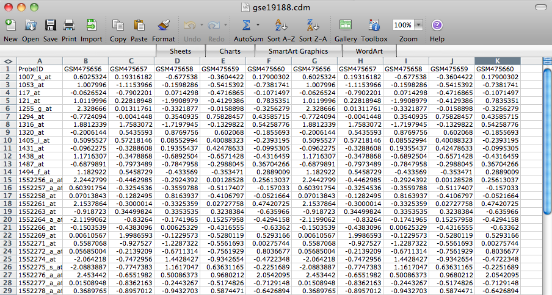
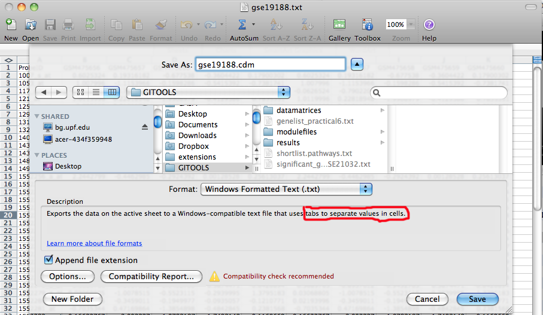

======================================================================================
How to prepare matrix files for Gitools using a spreadsheet editor (Excel or similar)
======================================================================================

Gitools accepts several easy to prepare formats to represent matrices. See :doc:`this section <UserGuide_ImportingData>`
of the userguide for more details on the different formats. All of them could be easily prepared using spreadsheet
editors. Just save the file as “Tab separated file” and it will be ready to be used in Gitools.

For example, Continuous data matrix (CDM) file format is commonly used for expression microarray data.
If you have a file with your microarray data in excel format, for example like this:

Save it in a txt format with columns separated by tabs and change the extension to :file:`.cdm` (for continuous data matrix).
If you leave the extension :file:`.txt` it will also work in Gitools, but you will have to specify that it is a CDM.

