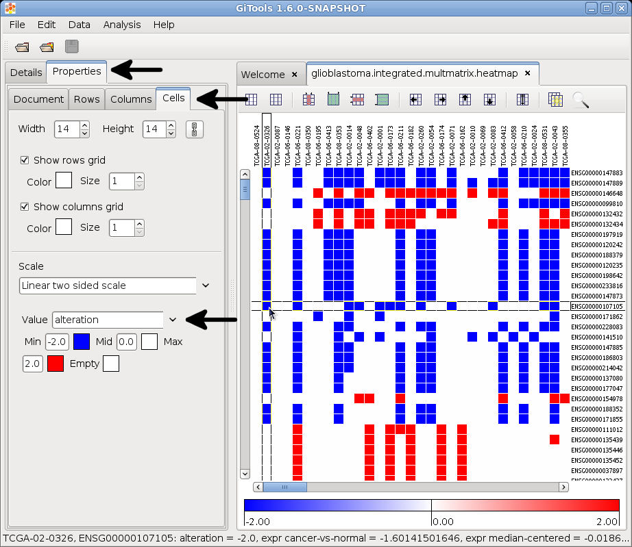

HowtoMultiDimensionalData
-------------------------------------------------

Table of Contents
-------------------------------------------------

`Files/Data needed <#N1003A>`__  `#  <#N1003A>`__

`Browse in Gitools <#N1011C>`__  

Simple table:

Gitools accepts a matrix format (.tdm) that contains various values per cell - or in other words multi-value matrices. This is especially helpful for browsing genomic data as nowadays study data is being released with expression, mutation, CNA and more data for each patient.

Files/Data needed
-------------------------------------------------

For whatever data you want to browse, you need to prepare a **multivalue-data matrix** (extension .tdm). For genomics data it may look like this:

==========  =======  ===========   =====  =====
column      row      expression    CNA    mutation
==========  =======  ===========   =====  =====
patient_01  gene_A   8.5           0      0
patient_01  gene_B   2.3           -2     0
patient_02  gene_A   6             0      1
patient_02  gene_B   5             0      0
patient_03  gene_A   12.1          2      0
patient_03  gene_B   4.9           0      1
==========  =======  ===========   =====  =====

example above

This is an example with three columns and two rows. Each cell has three data values. **Download this example **\ `**matrix** <url('file:/usr/local/gitools/help/xwiki-enterprise-jetty-hsqldb-2.5/jetty/work/Jetty_0_0_0_0_8888_xwiki__xwiki__snanx9/jTzWWANo/UserGuide.HowtoMultiDimensionalData.multivalue-matrix-example.tdm')>`__\ ** ** as file.

Browse in Gitools
-------------------------------------------------
`#  <#N1011C>`__

   
Select the option *File -> Open -> Heatmap*

In the dialog that pops up select as file Filter (the lowest box) one of the following two options:

Multivalue data matrix (tdm, tdm.gz)

Multivalue data matrix (\*.\*)

Once the heatmap is opened in Gitools, go to the tap  *Properties / Cells. *  Under the section  *Scale *  you will find a drop-down menu called  *Value *  that let’s you switch between the different attributes. The screenshot to the right helps you to find the option.
