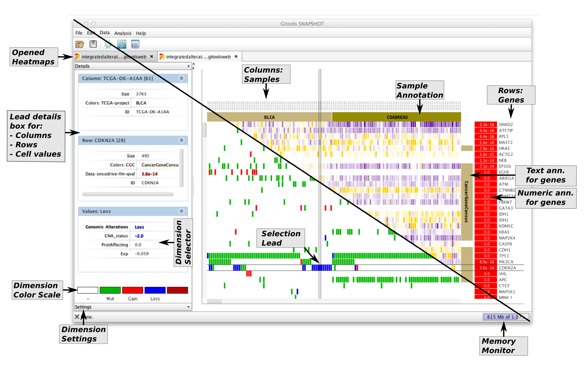

================================================================
How to browse multi-dimensional genomics data in Gitools?
================================================================

Simple table:

Gitools accepts a matrix format (.tdm) that contains various values per cell - or in other words multi-value matrices. This is especially helpful for browsing genomic data as nowadays study data is being released with expression, mutation, CNA and more data for each patient.

Files/Data needed
-------------------------------------------------

For whatever data you want to browse, you need to prepare a :ref:`tdm`. For genomics data it may look like this:

==========  =======  ===========   =====  =========
column      row      expression    CNA    mutation
==========  =======  ===========   =====  =========
patient_01  gene_A   8.5           0      0
patient_01  gene_B   2.3           -2     0
patient_02  gene_A   6             0      1
patient_02  gene_B   5             0      0
patient_03  gene_A   12.1          2      0
patient_03  gene_B   4.9           0      1
==========  =======  ===========   =====  =========

This is an example with three columns and two rows. Each cell has three data values.
**Download this example matrix**: :download:`files/multivalue-matrix-example.tdm`.

Browse in Gitools
-------------------------------------------------

   
Select the option *File -> Open -> Heatmap*

In the dialog that pops up select as file Filter (the lowest box) one of the following two options:

- Multivalue data matrix (tdm, tdm.gz)
- Multivalue data matrix (\*.\*)

Once the heatmap is opened in Gitools, go click on the dimension of data you want to see in the
**details dialog** to the left (see *Dimension selector* in the screenshot to the right)
