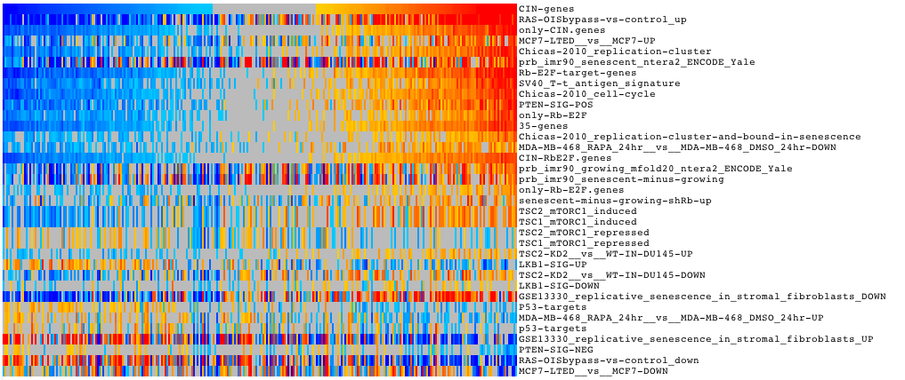

=============================================================
How to run Sample Level Enrichment Analysis (SLEA) in Gitools
=============================================================

Sample Level Enrichment Analysis (SLEA) using Gitools
-----------------------------------------------------

SLEA is a method to analyse the transcriptional status of gene modules (gene sets) per sample in a transcriptomic dataset. The results are presented in the form of interactive heatmaps which facilitates their interpretation. It can be used to identify tumor subtypes, correlate molecular features with clinical features and study relationship between modules.

Files needed
............

**Normalized expression matrices**. See for example  `”expression matrices used in Gundem and Lopez-Bigas 2012” <http://bg.upf.edu/slea/datasets/experiments>`__  which contains median-centered log-intensity values divided by standard deviation for 12 datasets.

**Clinical information of samples** if available. See for example  `”sample information for datasets used in Gundem and Lopez-Bigas 2012” <http://bg.upf.edu/slea/datasets/samples>`__

**Gene modules**. See for example  `modules used in Gundem and Lopez-Bigas 2012 <UserGuide_SpecialFileExtensions.rst>`__  of the user guide for further information on how to import gene modules with Gitools.

Perform an enrichment analysis with Gitools
...........................................

#. See  :doc:`this chapter <UserGuide_Enrichment>`  for details on how to perform enrichment analysis

#. Select a normalized expression matrix as data file (eg. breast-gse4922-gpl96.cdm.gz).

#. Do not select any filtering option.

#. Select a file with gene modules as module file (eg. :file:`senescence_related_modules_affy.tcm.gz`).

#. Select zscore statistical test. Write 100 in sampling size for a quick test of the analysis. To get a definitive result run the analysis with 10000, however take into account that in this case the analysis will take long time to finish. Leave estimator and multiple test correction as default.

#. Give a name to the analysis. Select a directory where to safe it and click Finish.

If you have a memory problem, see memory configuration in  :doc:`this chapter <UserGuide_Installation>` to increase the
memory allocated to run Gitools.

Explore the results
...................

The results are presented in the form of interactive heatmaps. See `Gitools Help <http://help.gitools.org>` to learn how to explore the results

:width: 75%
   :align: center
