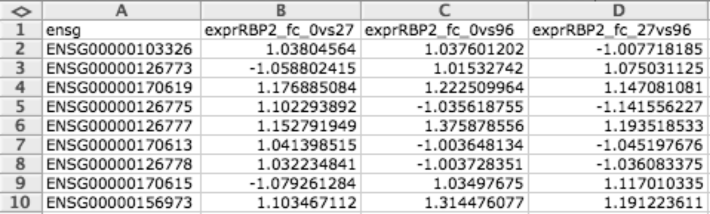
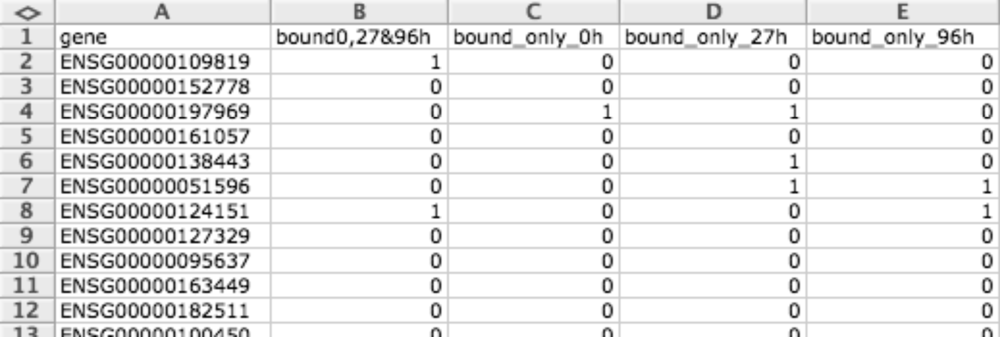
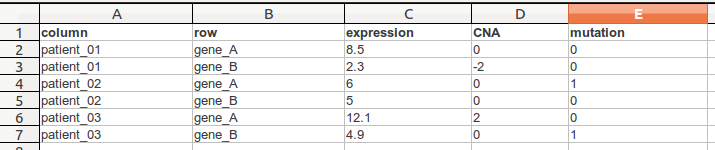
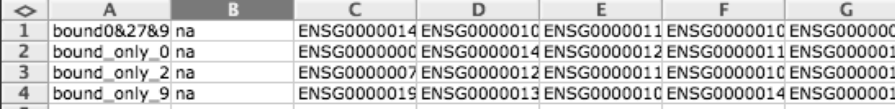
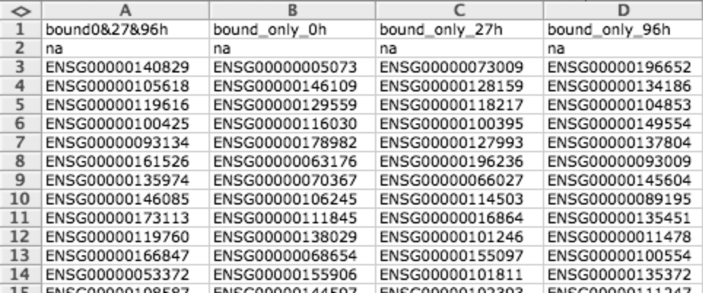

================================================================
Importing data to Gitools
================================================================

.. contents:: 

.. _importformats:

Data import: file formats
--------------------------------

Various formats are accepted in Gitools to represent each of these data types. The following table list the file formats accepted for each data type and in the following sections each file format is described.

=============================== ================================================ 
In Gitools                      Accepted format         
=============================== ================================================ 
Matrix Heatmap (single-value)         
                                - ``.bdm, .bdm.gz`` (Binary matrix)
                                - ``.cdm, .cdm.gz`` (Continuous data matrix)
                                - ``.gmx, .gmz.gz`` (Gene matrix)
                                - ``.gmt, .gmt.gz`` (Gene matrix transposed)
                                - ``.tcm, .tcm.gz`` (Two columns mapping)
Matrix Heatmap (multipe values)  
                                - ``.cmatrix, .cmatrix.gz`` (Compressed Heatmap)
                                - ``.tdm, .tdm.gz`` (Multi-value data matrix)
                                - ``.xls, .xlsx`` (Excel, table format)
Annotation                      - ``.tsv, .txt`` (tab separated values)
Module (Gene Sets)              - ``.gmx, .gmz.gz`` (Gene matrix)
                                - ``.gmt, .gmt.gz`` (Gene matrix transposed)
                                - ``.tcm, .tcm.gz`` (Two columns mapping)
                                - ``.ixm, .ixm.gz`` 
=============================== ================================================ 

Any of the presented formats can be compressed using gzip and recognized if the suffix .gz is appended at the end of the file name, so for example the file matrix.cdm could be compressed using gzip and renamed to matrix.cdm.gz and Gitools would be able to read it without problems.

.. _datatypes:

Data types
-------------------------------------------------

There are different kinds of data needed to import for different features in Gitools (Matrices, Modules and Annotations).

Matrices
...................

A matrix is a bidimensional structure in which for each row and column there is a value (one value-dimension) or multipe values (multiple value-dimensions). All the values are of one dimension are the same type (for example all are p-values or log ratios).

Matrices provide values for a number of items (i.e. one gene for each row) in several conditions/samples (i.e. one sample for each column). There could be empty values too (usually represented as a hyphen ’-’ or an empty field in text file formats).

Flat files that can be imported to Gitools can be distinguished into matrix-layout and table-layout

Flat files: matrix layout
,,,,,,,,,,,,,,,,,,,,,,,,,,,
Flat files containing data in  matrices can only contain data for a  single value dimension. Examples for files containing data in matrix form are ``.cdm`` and ``.tdm``. Here, **each line contains data for one heatmap row**

Flat files: tables form
,,,,,,,,,,,,,,,,,,,,,,,,
A flat file containing multiple value dimensions (multiple values per cell) need to be in the column form where **each line in the file contains data for one cell in the heatmap**. See for exampe the ``.tdm`` format

Modules
.................

Modules are lists of genes or other biological elements with a common biological property. They are also known as gene sets or concepts. For example, genes in the same pathway or genes regulated by the same transcription factor can form toghether one module. You can have many modules, i.e one for each known pathway or TF.

Annotations
.................
A table represents a list of attributes, where each row is an element of the list and each column an attribute where the first column has to be the id of the heatmap column or row. Each attribute can be of different type (i.e. one column with the gene id and other with a log-ratio). For R users it is the equivalent to data.frame.

In Gitools they are used for different things, for providing extra attributes to row and column labels in heatmaps and for representing results of some analysis.

Import data from external sources
-------------------------------------------------
Gitools has built-in data importers from different external data sources like *Biomart*, *IntOGen*, *Ensembl* or *KEGG*. See the  :doc:`importing data section <UserGuide_ExternalDataSources>` for details.

Gitools also disposes over commands for external control which can be used by other platforms to launch Gitools and launch their own data. See the  :doc:`external control of Gitools <UserGuide_ExternalControl>`  if you wish to use the available interfaces.

Prepare your own data
-------------------------------------------------

The easiest way to create data is using for example a program like *Excel* or *OpenOffice* and then export to tabulated text file. See the  :doc:`How to sections <UserGuide_HowtoModuleFilesSpreadsheet>`  with spreadsheet editors.

.. _cdm:

Continuous data matrix (CDM)
..................................................

CDM file format is a tab delimited matrix of items (i.e. genes) and conditions. The numbers in each cell indicates the values that this item has in that condition. Empty values can be represented with the hyphen ’-’.

It is useful for representing matrices (i.e. expression data for a microarray).

Binary data matrix (BDM)
..................................................

BDM file format is a tab delimited binary matrix of items (i.e. genes) and conditions. Values can only be 1 or 0, and can have different meanings depending what are they used for. Empty values can be represented with the hyphen ’-’.

They are useful for representing matrices as well as modules.

When representing matrices a 1 means that this item (row) presents a positive event (for example a mutation) in this condition (column) and 0 otherwise.

When representing modules, rows correspond to genes or biological elements and each column a different module, then a 1 is used to specify that a given gene or biological element is related to a given module and 0 otherwise.

.. _tdm:

Multi-value data matrix (TDM)
..................................................

TDM file format is a tab delimited file that has contains multiple values per row (gene) and column (sample). The first line is a header line following a line for each cell.

In this following example we see a .tdm-file that contains three columns and two rows.

Gene matrix transposed (GMT)
..................................................

GMT file format is a simple tab delimited file to provide gene sets. Each row describes a gene set, the first column indicates the name of the gene set and the second column the description (you can leave description empty), the rest of columns are used to enumerate the genes related to this gene set.

Usually this format is used for representing modules but can also be used to represent binary data matrices (i.e. when you have lists of differentially expressed gens for different conditions).

This format is the same used in  `GSEA tool <http://www.broadinstitute.org/gsea/>`__ .

Gene matrix (GMX)
..................................................

GMX file format is a simple tab delimited file to provide gene sets. Each column describes a gene set, the first row indicates the name of the gene set and the second row the description (you can leave description empty), the rest of rows are used to enumerate the genes related to this gene set.

Usually this format is used for representing modules but can also be used to represent binary data matrices (i.e. when you have lists of differentially expressed gens for different conditions).

This format is the same used in  `GSEA tool <http://www.broadinstitute.org/gsea/>`__ .

Two columns mapping (TCM)
..................................................

TCM file format is a simple tab delimited file to provide gene sets. It has two columns, the first column indicates the ID of gene or biological element and the second column the name of the module it belongs to.

Usually this format is used for representing modules but can also be used to represent binary data matrices (i.e. when you have lists of differentially expressed gens for different conditions).

This format uses more disk space than others so it is better to use some of GMX or GMT, but usually it is how you get data from Biomart so Gitools supports it too.

Tab separated values (TSV)
..................................................

This format is a generic text file format used for many different things. The main characteristic is that uses the tab character for separating fields and new line character/s for separating rows. All of the previous formats are based on it.

It can be used to represent matrices, modules and tables.

