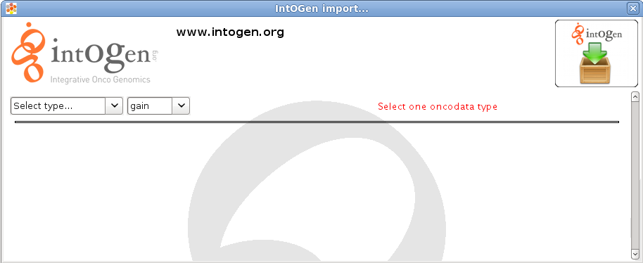
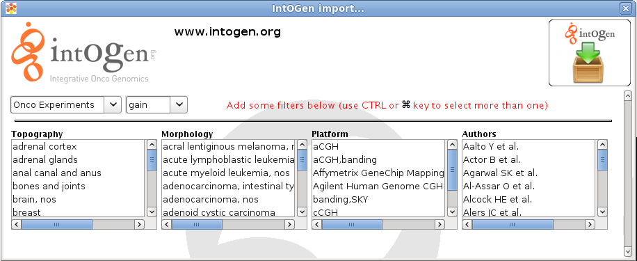
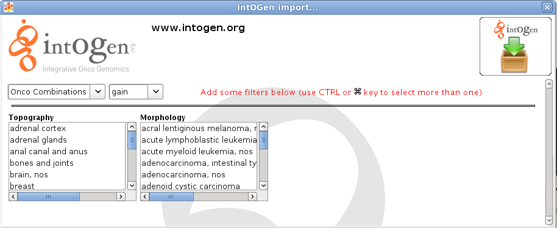

================================================================
IntOGen Arrays
================================================================

What is IntOGen Arrays?
-------------------------------------------------

The availability of data from a growing number of oncogenomic studies provides an unprecedented opportunity to understand tumor development from a genomic perspective. However, new integrative methodologies are necessary in order to take full advantage of these valuable data. IntOGen arrays is a novel framework that addresses this by collecting, organizing, analyzing and integrating genome-wide experiments that study several types of alterations in numerous cancer types. IntOGen arrays explores the data at different levels, from individual experiments to combinations of experiments that analyze the same tumor type, and from individual genes to biological modules (or gene sets). For more information about IntOGen arrays see  `Gundem et al., Nature Methods, 2010 <http://www.ncbi.nlm.nih.gov/pubmed/20111033>`__  or visit  `http://www.intogen.org <http://www.intogen.org>`__ .

Gitools allows to import data from IntOGen arrays in order to analyze and explore it in a convenient way.

Oncogenomic data
-------------------------------------------------

Oncogenomic data comprise a collation of independent experiments that analyze different types of alterations (such as copy number alterations, point mutations, differential gene expression or methylation aberrations) in a number of cancer samples. The current version of IntOGen arrays includes transcriptomic alterations, genomic gains and losses, and somatic mutation information. All samples are annotated according to the International Classification of Disease for Oncology (ICD-O) using two terms, the topography and morphology of the neoplasm. All experiments are additionally annotated with information about the original authors, publication and platform used.

Currently there are two types of data that can be accessed from Gitools:

Significance of genes being driver alterations for transcriptomic and/or genomic alterations.
----------------------------------------------------------------------------------------------

All experiments collated and shown in IntOGen arrays analyze alterations in cancer cells compared to normal cells (normal cells of the same tissue in the case of expression), in order to identify which are the main changes involved in the development of different cancer types. The first step in the IntOGen arrays analysis pipeline is to assess the significance of each alteration in each experiment independently, this results in a p-value per gene and experiment. In Gitools this data can be imported as matrices of p-values where each row represents a gene and each column an experiment and it is shown as Onco Experiments type.

Moreover, after computing p-values for alteration events seen in individual studies, in order to integrate the information from different experiments analyzing the same cancer type/subtype, a combined test of significance of alteration events across a set of experiments with the same clinical annotation is done. The results of combination of experiments by tumor type (according to ICD-O terms) can be imported as p-value matrices too where each row represents a gene and each column a tumor type. It is shown as Onco Combinations type.

To start the import of these IntOGen arrays data go to the main menu and select the menu :code:`File > Import > IntOGen > Matrix ...`

:width: 700px
   :align: center
       :alt: select type

    A window like the one shown before will appear asking for selecting a type, then select Onco Experiments or Onco Combinations depending on the data of your interest. Once the type is selected, you should select the alteration of interest, currently it can be gain and loss for genomic alterations and upreg and downreg for upregulated and downregulated transcriptomic data.

    The next step consists on filtering the data by topography, morphology, platform and authors if Onco Experiments was selected, or topography and morphology if Onco Combinations was selected. It is possible to select many options for each filter. To do this maintain the CTRL key (or ⌘ in Mac) and select different options.

:width: 700px
   :align: center
       :alt: select type

:width: 700px
   :align: center
       :alt: select type

    The total number of columns that will be downloaded will be shown in red. There are some restrictions regarding the maximum number of columns that can be downloaded at the same time (a message will appear in red warning on that), so filters have to be applied to reduce the number of columns.

Modules (gene sets) of genes susceptible to be altered in cancer.
------------------------------------------------------------------

When identifying the significance of alterations at the level of genes, genes are assumed to be independent from each other. However, genes related to each other in some biological way might share similar alteration patterns. To be able to detect such tendencies in the oncogenomic data, the p-values of genes can be analyzed by enrichment analysis. There are quite a lot of modules already prepared for different biological aspects. Different modules (gene sets) are already prepared in IntOGen arrays representing sets of genes susceptible to be altered in different tumor types and experiments that can be used to analyze your data with an enrichment analysis.

As well as in the case of matrices they are prepared for experiments and for combination of tumor types (by ICO-O terms). To start the import of oncomodules go to the main menu and click on *File > Import > IntOGen > Oncomodules ..*.

A window like the one shown before will appear asking for selecting a type, then select Onco Experiments or Onco Combinations.

The next step consists on filtering the data by condition, topography, morphology, platform and authors if Onco Experiments was selected, or condition, topography and morphology if Onco Combinations was selected. It is possible to select many options for each filter. To do this maintain the CTRL key (or ⌘ in Mac) and select different options.
