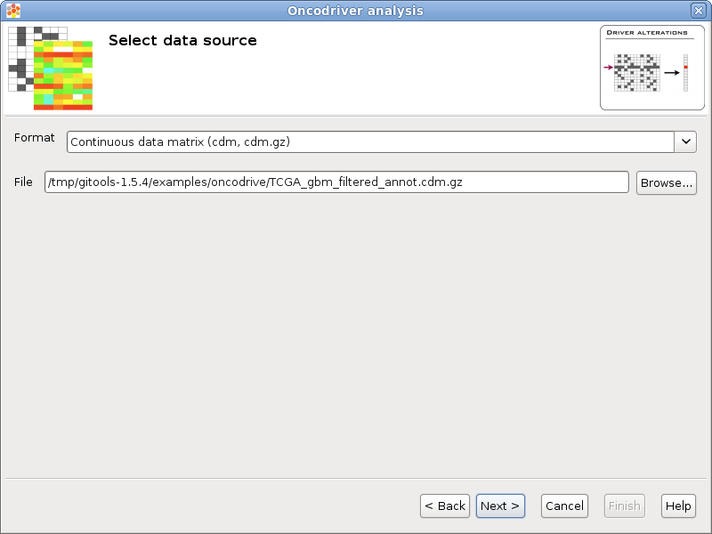
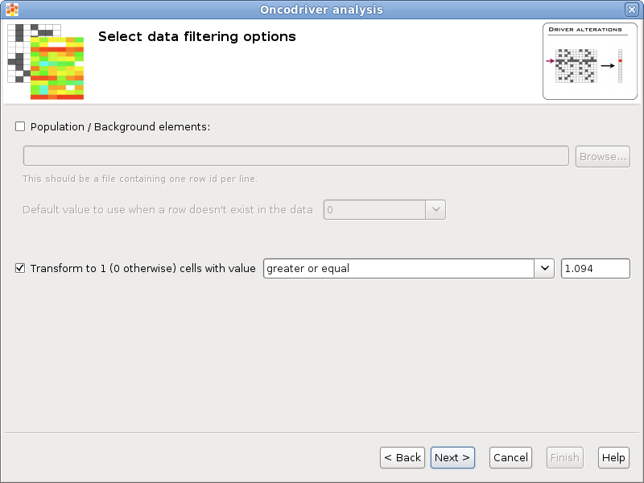
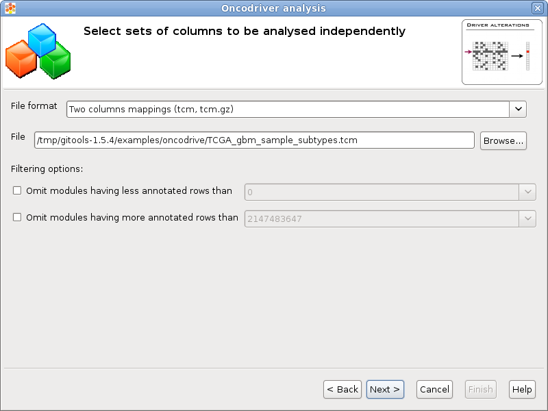
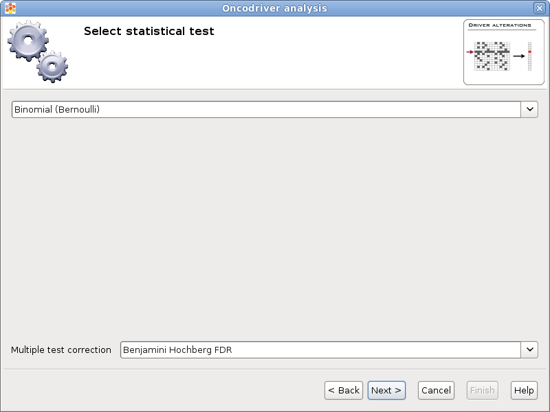

================================================================
Oncodrive
================================================================

Oncodrive analysis can be used to identify genes that are significantly altered in a set of tumours. You will find more details on  `IntOGen paper <http://www.nature.com/nmeth/journal/v7/n2/full/nmeth0210-92.html>`__ .

Wizard steps to perform an oncodrive analysis
-------------------------------------------------

Before running an oncodrive analysis you should have this data prepared in files:

A matrix with the data resulting of your experiment (i.e. an expression matrix) or a list or lists of elements (i.e. genes or probesets) that has been found significant after other analysis (i.e. after differential expression you get lists of genes over and under expressed).

A list of all elements (i.e. probesets or genes) that conform the background population of your analysis. For example, in the case of an affymetrix microarray the population would be all the probesets of the microarray. This is not necessary if you have a matrix with data for the whole population.

Modules (i.e. gene sets related by Gene Ontology biological process) to analyze enrichment for.

To start the oncodrive wizard go to the menu *File > New > Analysis > Oncodrive analysis ...*

Presentation and example
-------------------------------------------------

If you select the option **Fill this wizard with an example** all the following wizard pages will be filled with example files and parameters. In some situations the example files will be downloaded automatically before you can go to the next page. By default, when Gitools is installed from the zip file, the examples are already included. But when Gitools is executed directly from the web page the example files have to be downloaded the first time they are used. In that case the files are cached at *$HOME/.gitools/examples*.

You can avoid this first presentation page by selecting the option **Don’t show this page next time**.

Selection of the data to analyze
-------------------------------------------------

If you follow the conventions on file formats explained  `here <UserGuide_LoadingData.rst>`__  then simply click on the button [Browse] and select the file containing the data to analyze. The format selector will recognize the extension of the file. If your data file doesn’t have a known file extension then you should specify which is the format of the file.

Selection of the data transformation options
-------------------------------------------------

**Population / Background elements:** This field can be left blank if the data file contains data for all background elements, otherwise a file with the elements of the background population should be selected. The format of this file is a simple text file with one element per line. For example the list of all the protein coding genes, each one in a different row. All the rows in the data that don’t appear in the population will be removed and all the elements specified in the population that don’t appear in the data will be added to the data with the default value specified by the user.

**Transform to 1 / 0:** Some statistical tests are designed to work with discrete events (as Binomial or Fisher’s exact tests), this option allows to transform a matrix with real values into a binary matrix containing only 1’s and 0’s for the analysis. All the values which satisfy the condition will be transformed to 1 and the rest to 0. For example, if the data file is an expression matrix with log :sub:`2` ratios it can be transformed to a binary matrix having a 1 for all the log :sub:`2` ratios greater than 1.5. Other possible application is when the matrix have p-values, if a significance of 0.05 is considered, all values less than 0.05 could be transformed to 1’s.

Selection of set of columns
-------------------------------------------------

You can analyse different independent oncodrive analysis on different sets of columns from the same data. Each column set analysis will generate results in different columns that can be compared easily in a heatmap.

**File format & File:** A file containing the column sets can be selected pressing the button [Browse...] and selecting a file. The format of the file will be automatically detected if the file extension matches any of the known file formats, otherwise a warning will appear and it should be the user who selects the appropiate format.

**Filtering options:** If the number of columns of one set is too low some tests could not generate reliable results (i.e. zscore or bionamial tests). It is possible to discard the column sets with less or more than a certain quantity using this filters.

Selection of the statistical test
-------------------------------------------------

There are different types of statistical tests that can be used, in this page the user can select the one that he/she wants to use in the selector on the top.

Currently there are two different statistical tests implemented for oncodrive analysis in Gitools:

`Binomial test <http://en.wikipedia.org/wiki/Binomial_test>`__

`Z-score test <http://en.wikipedia.org/wiki/Z-test>`__  with  `bootstrapping <http://en.wikipedia.org/wiki/Bootstrapping_(statistics)')>`__

As multiple tests are performed it is important to adjust the p-values. The method for adjusting the p-values can be chosen in the **Multiple test correction** option.

Selection of the destination file
-------------------------------------------------

This wizard page allows to specify the prefix name for the files generated during the analysis and the folder where they will be created. The text in name and folder can be freely edited but it is also possible to navigate through the system folders in order to select an existing file by pressing the button [Browse].

Analysis details
-------------------------------------------------

This step is optional but recommended as it allows to give some details about the analysis for better organization and annotation of the results for future reviews.

It is possible to specify free attributes for the analysis as Organization, Operator, Platform and so on.

Exploring the results of the analysis
-------------------------------------------------

After performing the analysis a new editor with the details of the analysis will be opened:

To explore the data matrix resulting from the transformations with a heatmap click on the **Heatmap** button in the **Data** section.

To explore the results of the analysis with a heatmap click on the **Heatmap** button in the **Results** section.

