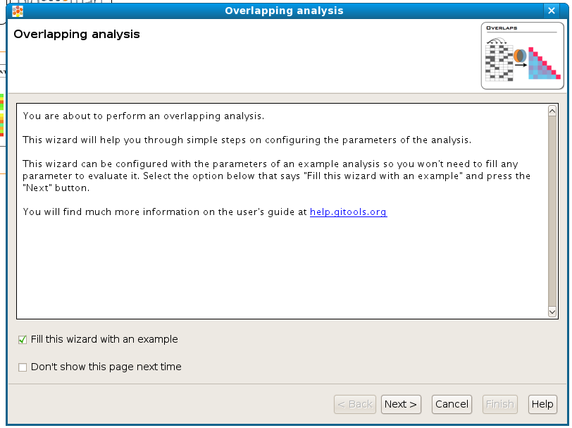
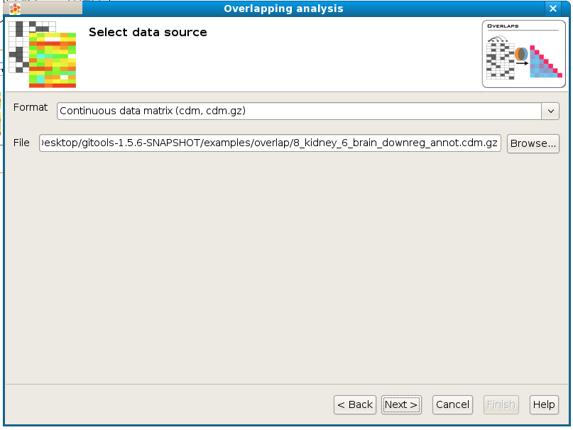
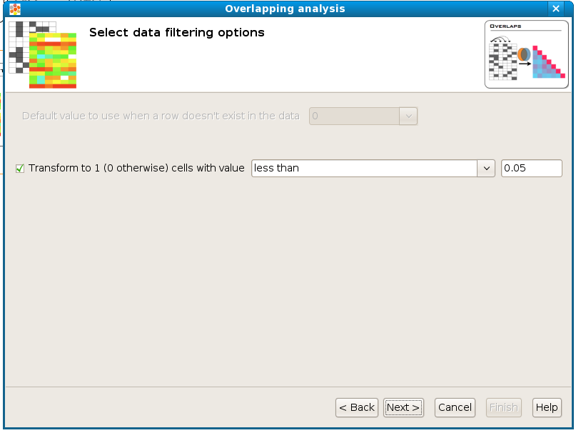
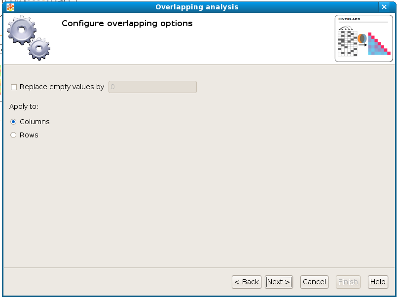
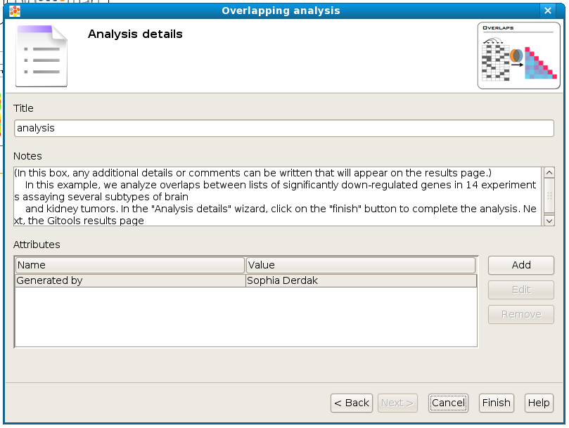
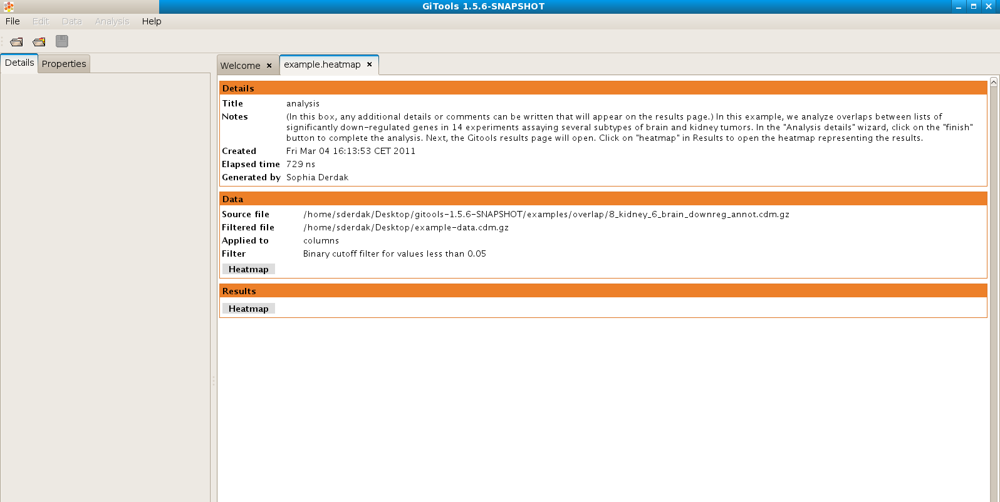
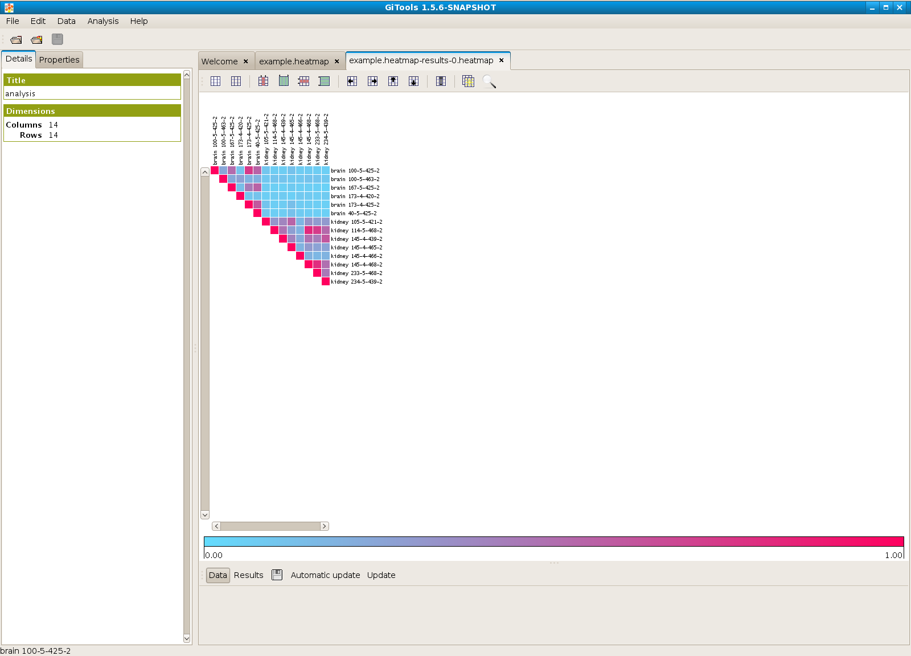

================================================================
Overlaps
================================================================

This analysis is useful to study the overlap of positive elements between columns and rows in a binary matrix. For example, to compare the list of genes altered among many samples by pairwise comparison.

Wizard steps to perform an overlapping analysis
-------------------------------------------------

Before running an overlapping analysis you should have this data prepared in files:

A matrix with the data resulting of your experiment (i.e. an expression matrix) or a list or lists of elements (i.e. genes or probesets) that has been found significant after other analysis (i.e. after differential expression you get lists of genes over and under expressed).

To start the wizard go to the menu *File > New > Analysis > Overlapping analysis ...*

You can also start an overlap analysis from an opened heatmap by selecting the menu *Analysis > Overlapping.*

Presentation and example
-------------------------------------------------

:width: 700px
   :align: center

    If you select the option **Fill this wizard with an example** all the following wizard pages will be filled with example files and parameters. In some situations the example files will be downloaded automatically before you can go to the next page. By default, when Gitools is installed from the zip file, the examples are already included. But when Gitools is executed directly from the web page the example files have to be downloaded the first time they are used. In that case the files are cached at *$HOME/.gitools/examples*. See details of the example analyses  `here <http://help.gitools.org/xwiki/bin/view/Examples/>`__ .

You can avoid this first presentation page by selecting the option **Don’t show this page next time**.

Selection of the data to analyze
-------------------------------------------------

:width: 700px
   :align: center

    If you follow the conventions on file formats explained  `here  <UserGuide_LoadingData.rst>`__ then simply click on the button [Browse] and select the file containing the data to analyze. The format selector will recognize the extension of the file. If your data file doesn’t have a known file extension then you should specify which is the format of the file.

Selection of the data transformation options
-------------------------------------------------

:width: 700px
   :align: center

**Transform to 1 / 0:** The tests used in this overlapping analysis work with discrete events, 0 and 1. This allows to count lists of positive genes (1’s) or negative genes (0’s) and to look for overlaps of these lists between different samples. Therefore, this step transforms a matrix with real values into a binary matrix containing only 1’s and 0’s for the analysis. All the values which satisfy the condition will be transformed to 1 and the rest to 0. For example, if the data file is an expression matrix with log :sub:`2` ratios it can be transformed to a binary matrix having a 1 for all the log :sub:`2` ratios greater than 1.5. In another case the matrix may consist of p-values: When we consider a p-value significant that is below 0.05,  all values that satisfy the condition “less than 0.05” could be transformed to 1’s.

Configure overlap options
-------------------------------------------------

:width: 700px
   :align: center

    When overlapping two columns/rows it may happen that one or both of them don’t have a value defined in a particular cell (such as a gene that was assayed in some columns of the matrix but not in these two) no overlap can be calculated for these empty cells.  With the option **Replace empty values by** and put a value then empty cells will be filled with this value when doing calculations. The recommended value to fill in is 0.

The option **Apply to** allows to select whether to overlap column-wise or row-wise.

Selection of the destination file
-------------------------------------------------

:width: 700px
   :align: center

    This wizard page allows to specify the prefix name for the files generated during the analysis and the folder where they will be created. The text in name and folder can be freely edited but it is also possible to navigate through the system folders in order to select an existing file by pressing the button [Browse].

Analysis details
-------------------------------------------------

:width: 700px
   :align: center

    This step is optional but recommended as it allows to give some details about the analysis for better organization and annotation of the results for future reviews.

    It is possible to specify free attributes for the analysis as Organization, Operator, Platform and so on. Click on [finish] to perform the analysis.

Exploring the results of the analysis
-------------------------------------------------

After performing the analysis a new tab with the details of the analysis will be opened:

:width: 700px
   :align: center

    To view the results of the analysis in heatmap format click on the **Heatmap** button in the **Results** section.

:width: 700px
   :align: center
