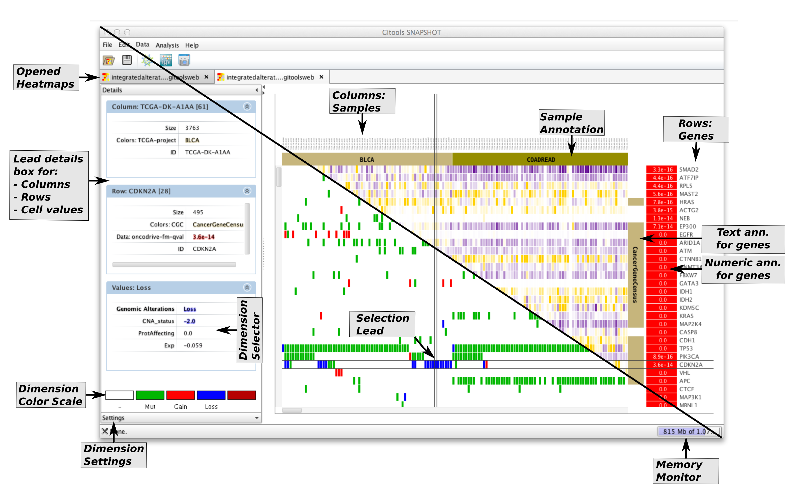

================================================================
Visualization: The Gitools interface
================================================================

The main window of Gitools is divided in two parts: the left part or the contextual panels and the right part or editors panel.

On the left there are some tabs that show contextual information and configuration of the elements selected on the hetmap editor on the right. Each tab represents a document that is opened.

:width: 80%
   :align: center

    Gitools is document editor oriented, this means that you can have many documents opened at the same time, edit
    them and save changes. For each kind of document you would have at least one type of editor, so for example a
    matrix can be visualized with a heatmap.

    There are also editors that simply show information and create other editors.
    An example of this is the analysis editor that shows all the parameters of an analysis
    that was performed before and allows to create heatmaps for the data and the results.